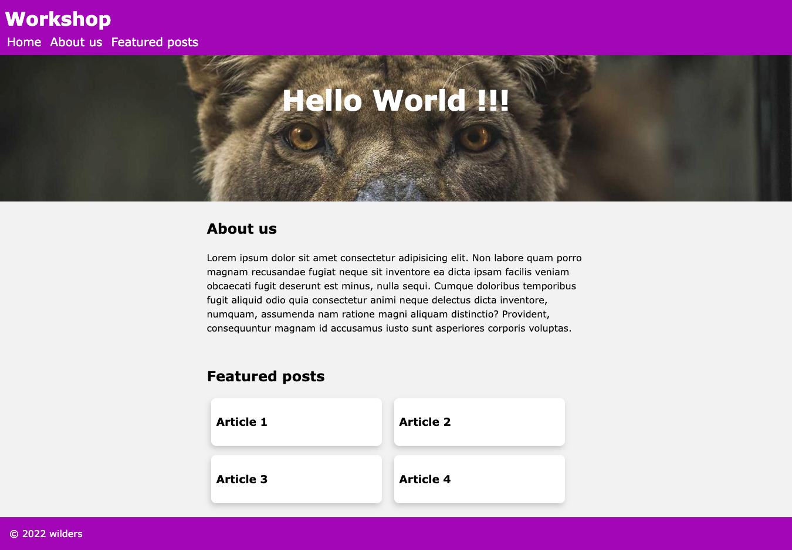

<h1 align="center">Bienvenue sur HTML/CSS Basics 👋</h1>

  

## 🎯 Objectifs

-   Comprendre les bases du HTML et du CSS
-   Créer une page web simple
-   Utiliser les balises HTML sémantiques
-   Utiliser les sélecteurs & propriétés CSS

## 📝 Instructions

Vous devez reproduire la page suivante :

## Affichez votre soutien

## Donnez un ⭐️ si ce projet vous a aidé !

### 🗃️ Version

-   **v.0.0.1** - First commit

---

### 👋 Qui suis-je ?

Je suis **Anthony Gorski**, développeur web et formateur à la [Wild Code School](https://www.wildcodeschool.com/fr-FR).
